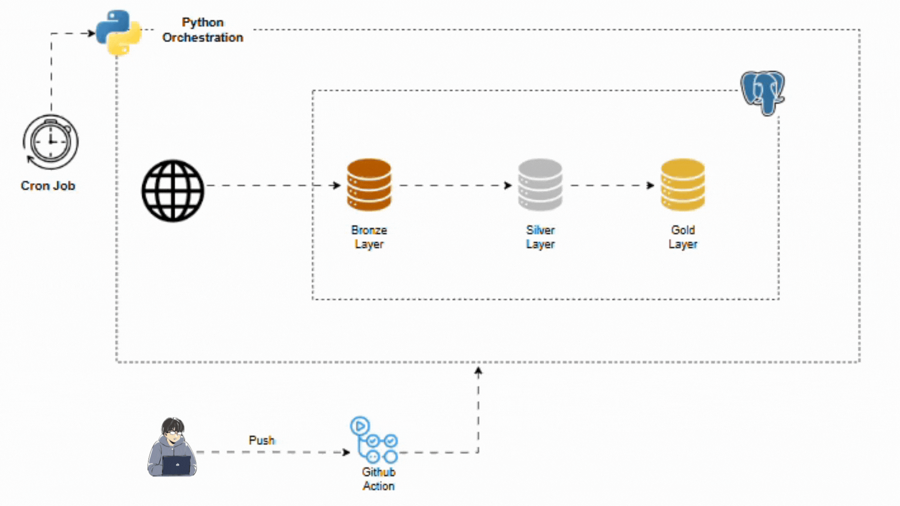

# NYC TAXI DATA PIPELINE (Python + PostgreSQL)

## Navigation / Quick Access

- [Overview](#overview)
- [Project Objective](#project-objective)
- [Project Architecture](#project-architecture)
- [Repository Structure](#repository-structure)
- [Pipeline Flow and Logic](#pipeline-flow-and-logic)
- [Reproducing the Project](#reproducing-the-project)
- [Testing & Validation](#testing-and-validation)

---

## Overview

This project implements an end-to-end **data pipeline for the NYC Yellow Taxi 2024 dataset**, using:

- **Python** for orchestration, downloading, and loading monthly parquet files.
- **PostgreSQL + PL/pgSQL** for incremental ingestion logic, transformations, and aggregations.
- A **Medallion Architecture** with three layers:

    - **Bronze (Raw)** – Incremental ingestion from external parquet files, metadata tracking, and invalid-record logging.
    - **Silver (Transformed)** – Cleaned, standardized, and normalized tables (with partitions) ready for analytics.
    - **Gold (Aggregated)** – Business-ready aggregate tables for downstream reporting/BI.

The pipeline is designed to be **idempotent** (safe to re-run without double counting) and observable (metadata and logs).

---

## Project Objective

The objective is to design and implement a **fully SQL-driven ETL pipeline orchestrated by Python** that:

- Downloads **monthly NYC Yellow Taxi parquet files** directly from the public cloudfront endpoint.
- Loads data **incrementally** into a Bronze layer using a stored procedure and metadata table.
- Tracks each pipeline run via:
  - A lightweight **metadata table** for status, runtime, and last processed timestamp.
  - An **invalid records table** for out-of-range/rejected rows.
- Performs **full-refresh transformations** from Bronze → Silver, including:
  - Cleaning and type normalization.
  - Dimension tables (vendor, payment type, rate code).
  - A partitioned fact table for efficient querying.
- Builds **Gold-level aggregates** for analysis (e.g. by month, vendor, payment method).
- Demonstrates a structure suitable for **CI/CD** with linting (flake8) and tests (pytest).

---

## Project Architecture


The architecture follows the Medallion pattern:

- **Bronze Layer (`bronze.*`)**
  - `bronze.yellow_taxi_raw`: main raw trip table populated incrementally.
  - Data comes from a monthly parquet file staged into a temporary `raw_stage` table via Python.

- **Silver Layer (`silver.*`)**
  - Normalized, cleaned tables, e.g.:
    - `silver.vendor`
    - `silver.payment_type`
    - `silver.ratecode`
    - `silver.yellow_taxi` (partitioned by pickup month)
  - Populated via a full-refresh SQL script.

- **Gold Layer (`gold.*`)**
  - Aggregated tables for analytics (e.g. revenue per day, per vendor, per payment type).
  - Populated via dedicated aggregation SQL.

- **Meta / Observability (`meta.*`)**
  - `meta.metadata_table`: records each run of the incremental procedure.
  - `meta.invalid_records`: stores out-of-range or otherwise rejected rows from staging.

---
## Repository Structure
```text
.
├── .env
├── .flake8
├── .gitignore
├── README.md
├── requirements.txt
├── .github
│   └── workflows
│       └── ci.yml
├── logs
│   ├── db_setup.log
│   └── pipeline.log
├── src
│   ├── db_setup.py
│   ├── etl_pipeline_run.py
│   ├── incremental_ingestion.py
│   ├── silver_gold_etl.py
│   ├── sql
│   │   ├── bronze_incremental_load.sql
│   │   ├── gold_aggregate_layer.sql
│   │   └── silver_full_refresh_transformation.sql
│   └── utils
│       ├── database_connection.py
│       ├── logging.py
│       └── __init__.py
└── test
│    └── test_download_url.py
└── image
    └── DEC II arch_diagram.gif
        
```

---
## Pipeline Flow and Logic

### 1. Metadata Management

The metadata table **`meta.metadata_table`** has the following columns:

- `last_load_date` – **timestamp** of the latest pickup datetime successfully loaded into Bronze.
- `status` – `meta.status_enum` with values:
  - `'success'`
  - `'failed'`
- `runtime` – **interval** showing how long the incremental procedure took to run.
- `error_message` – **text** storing the error message when a run fails; `NULL` on success.

Together, these fields let you see:

- When the pipeline last completed successfully.
- How long each run took.
- If/when a run failed and why.

In addition, `meta.invalid_records` mirrors the Bronze schema and stores rows that fall outside the allowed date window (or other basic validations), with a composite primary key to avoid duplicates.

---

### 2. Incremental Ingestion (Bronze Layer)

Incremental load is handled by a combination of **Python + PL/pgSQL**:

1. **Python ingestion (`incremental_ingestion.py`):**
   - Builds the download URL for a given year/month.
   - Reads the parquet file into a DataFrame.
   - Loads the data into a temporary staging table (`raw_stage`) in PostgreSQL (using fast bulk loading).
   - Calls the stored procedure:  
     `CALL bronze.incremental_load();`

2. **Stored procedure (`bronze.incremental_load` in `bronze_incremental_load.sql`):**
   - Reads the **earliest pickup datetime** from `raw_stage` and computes:
     - `month_start` = first day of that month.
     - `month_end` = first day of the next month.
   - Inserts into `bronze.yellow_taxi_raw` only rows where:
     ```sql
     -- only when pickup_datetime is greater than metadata last_load_date and within period window
     tpep_pickup_datetime > m_lld 
     AND (tpep_pickup_datetime >= month_start AND tpep_pickup_datetime < month_end);
     ```
   - Inserts all **out-of-range rows** into `meta.invalid_records` (with `ON CONFLICT DO NOTHING` on the composite key).
   - Computes:
     ```sql
     m_lld := MAX(tpep_pickup_datetime) FROM bronze.yellow_taxi_raw;
     ```
   - Measures **runtime** using `clock_timestamp()` at the start/end.
   - Logs into `meta.metadata_table`:
     - `last_load_date = m_lld`
     - `status = 'success'`
     - `runtime = end_time - start_time`
     - `error_message = NULL`

3. **Error handling / idempotency:**
   - In the `EXCEPTION` block, the procedure:
     - Captures the error text into `error_message`.
     - Logs a `'failed'` row into `meta.metadata_table` with `runtime` and `error_message`.
     - Re-raises the error so the Python pipeline can fail visibly.
   - Because we always calculate `last_load_date` from the actual Bronze table, re-runs without new data keep the same max timestamp and do not duplicate rows.

The net result: the pipeline is **idempotent** and **observable**.

---

### 3. Full Refresh Transformations (Silver Layer)

Once Bronze is populated, the Silver layer is built via **`silver_full_refresh_transformation.sql`**:

- **Vendor, Payment Type, Rate Code dimensions**
  - Populate lookup tables (`silver.vendor`, `silver.payment_type`, `silver.ratecode`) from distinct values in Bronze.

- **Fact table (`silver.yellow_taxi`)**
  - Casts data types (e.g. numeric vs text).
  - Adds derived fields (trip duration in minutes, etc.).
  - Partitions the table by `tpep_pickup_datetime` month:
    - `silver.yellow_taxi_p_2024_01`, `silver.yellow_taxi_p_2024_02`, …,
      each `FOR VALUES FROM ('YYYY-MM-01') TO ('YYYY-MM-01')`.

This phase is currently a **full refresh** (truncate + insert pattern), so Silver always reflects the latest consistent snapshot of Bronze.

---

### 4. Aggregation (Gold Layer)

Gold layer SQL (`gold_aggregate_layer.sql`) produces analytical summaries such as:

- Daily trip counts and revenue.
- Breakdown by vendor, payment type, rate code.
- Aggregations aligned with typical BI dashboards.

These tables are designed to be **thin, indexed, and directly consumable** by BI tools like Power BI, Looker Studio, or Tableau.

---

## Reproducing the Project

Below is a high-level guide to run the project locally. You can refine or update it as you evolve the repo.

### 1. Prerequisites

- **Python** ≥ 3.10
- **PostgreSQL** (e.g. 13+)
- `git`
- Internet access (to download NYC Taxi parquet files)

### 2. Clone the repository

```bash
git clone https://github.com/Blackbeard23/python-nyc-taxi-data-pipeline.git
cd python-nyc-taxi-data-pipeline
```

### 3. Create and activate a virtual environment
```bash
python -m venv env
env/scripts/activate
```

### 4. Install dependencies
```bash
pip install -r requirements.txt
```

### 5. Configure environmnet variable
Create a .env file in the project root
```ini
HOST=host
PORT=port
USER=database_user
PASSWORD=your_password
DBNAME=database_name
```
Adjust values to match your local RDBMs instance.

### 6. Run the database setup (schemas & tables)
```bash
python src/db_setup.py
```
This will:
- Create the target database.
- Create schemas (bronze, silver, gold, meta).
- Create base tables and partitions.
- Create the incremental stored procedure.


### 7. Run the end-to-end ETL pipeline
```bash
python src/etl_pipeline_run.py
```
This orchestrates:
- Incremental ingestion from source (web) directly to raw staging layer for the configured month range.
- Silver transformations (full refresh).
- Gold aggregations.

Check the logs:
- `logs/db_setup.log`
- `logs/pipeline.log`

for a detailed trace of each step.

---

